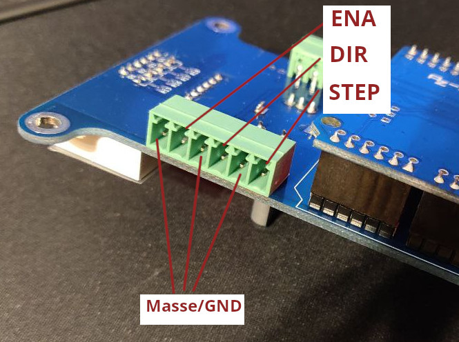
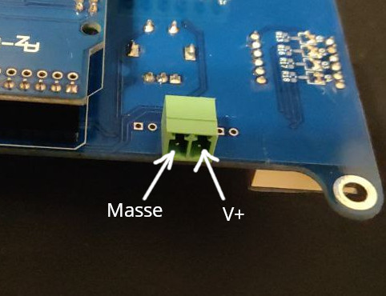
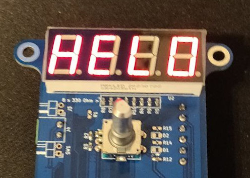
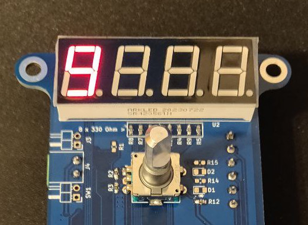
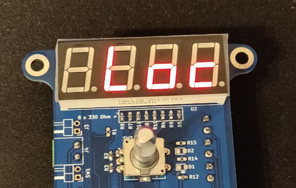
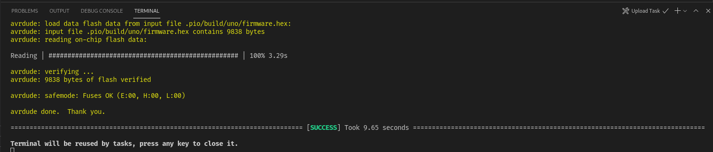

# Bedienungsanleitung

## Verkabelung
Es müssen nur die beiden grünen Steckverbinder verkabelt werden. An den 6-poligen Steckverbinder wird der Motortreiber angeschlossen. An den 2-poligen Steckverbinder wird die Stromversorgung angeschlossen.

### Motortreiber
Der Schrittmotortreiber muss auf 400 Schritte pro Umdrehung eingestellt werden. Falls das nicht möglich ist, oder eine andere Schritteinstellung verwendet werden soll, siehe unten Abschnitt im "Firmware Einstellungen".



Pin 1 des 6-poligen Steckverbinders J1 ist näher am Arduino, Pin 6 ist neben dem Schriftzug "J1". Die Pins müssen wie folgt verkabelt werden:

<table>
<thead>
	<tr>
		<th>Pin</th>
		<th>Bezeichnung</th>
		<th>Zugehöriger Pin am Motortreiber</th>
	</tr>
</thead>
<tbody>
	<tr>
		<td>J1.1</td>
		<td>STEP</td>
		<td>Schrittimpulseingang (meistens mit PUL, PULSE, STEP oder STP beschriftet)</td>
	</tr>
	<tr>
		<td>J1.2</td>
		<td>GND</td>
		<td>Masse für Schrittimpulseingang (meistens auch mit STEP- oder GND beschriftet)</td>
	</tr>
	<tr>
		<td>J1.3</td>
		<td>DIR</td>
		<td>Richtungseingang (meistens mit DIR oder DIR+ beschriftet)</td>
	</tr>
	<tr>
		<td>J1.4</td>
		<td>GND</td>
		<td>Masse für Richtungseingang (meistens mit DIR- oder GND beschriftet)</td>
	</tr>
	<tr>
		<td>J1.5</td>
		<td>STEP</td>
		<td>Enable-Eingang (meistens auch mit ENA oder ENA+ beschriftet)</td>
	</tr>
	<tr>
		<td>J1.6</td>
		<td>GND</td>
		<td>Masse für Enable (meistens mit ENA- oder GND beschriftet)</td>
	</tr>
</tbody>
</table>


### Versorgungsspannung
Am 2-poligen Steckverbinder J4 wird die Versorgungsspannung angeschlossen. Die Versorgungsspannung darf maximal 24V (Gleichspannung) betragen. Getestet wird mit 12V.


Die Pins von J4 (Achtung: Beschriftung ist auf gegenüberliegender Seite) sind gleich nummeriert wie die von J1, d.h. "unten" (also näher am Arduino) ist Pin 1.



<table>
<thead>
	<tr>
		<th>Pin</th>
		<th>Bezeichnung</th>
	</tr>
</thead>
<tbody>
	<tr>
		<td>J4.1</td>
		<td>GND</td>
	</tr>
	<tr>
		<td>J4.2</td>
		<td>V+ (kann zwischen )</td>
	</tr>
</tbody>
</table>


## Bedienung

Nach dem Einschalten zeigt das Board den Begrüßungstext "HELO" an.



Danach wird die Zahl der derzeit ausgewählten Schritte Pro Umdrehung angezeigt. Der Standardwert ist 1. Durch drehen des Drehencoders kann die Anzahl frei zwischen 1 - 9999 eingestellt werden. Im folgenden Bild wurde die Zahl auf den Wert 9 eingestellt. Pro Schritt wird also eine 9tel Umdrehung des Teilapparats bzw. 40° gefahren.



Durch drücken des Drehencoders wird die Zahl für die weiteren Schritte fest eingestellt. Der Text "Loc" erscheint.



Danach erscheint wieder die eingestellte Teil-Zahl. Das Gerät ist nun "scharf": Wenn der Drehencoder nun ein weiteres mal gedrückt wird, fährt der Teilapparat die eingestellte Strecke.

## Sonstiges

### Firmware Einstellungen
Die Software geht davon aus, dass der Schrittmotortreiber auf 400 Schritte pro Umdrehung eingestellt ist, und der Teilapparat sich bei 90 Umdrehungen der Eingangswelle um 360° dreht. Sollte das nicht der Fall sein, muss die Firmware angepasst werden.
Das geschieht mit der Software "Visual Studio Code" von Microsoft mit der Extension "PlatformIO". Die Firmware kann von https://github.com/Mindar/RundtischNC heruntergeladen werden.

In der Datei ```./include/config.hpp``` befinden sich alle Konfigurationsoptionen, die eingestellt werden können. Hier eine kurze Erkärung der Optionen:

<table>
<thead>
	<tr>
		<th>Bezeichnung</th>
		<th>Standardwert</th>
		<th>Beschreibung</th>
	</tr>
</thead>
<tbody>
	<tr>
		<td>INDEXING_HEAD_GEAR_RATIO</td>
		<td>90L</td>
		<td>Das Untersetzungsverhältnis des Teilapparats. Für eine Umdrehung des Ausgangs sind so viele Motorumdrehungen nötig.</td>
	</tr>
	<tr>
		<td>STEPS_PER_REV</td>
		<td>400L</td>
		<td>Anzahl der Schritte die der Motortreiber und Motor für eine Motorumdrehung benötigt. Wenn am Motortreiber die Microstep Einstellung geändert wird, muss dieser Wert ebenfalls geändert werden.</td>
	</tr>
	<tr>
		<td>MAX_SPEED</td>
		<td>90 * 5</td>
		<td>Die maximale Geschwindigkeit des Motors in Umdrehungen pro Minute. Bei zu hohen Werten verliert der Motor Schritte, bzw. der Arduino kann nicht schnell genug die Schritte schicken. In letzterem Fall wird die eingestellte Geschwindigkeit nicht erreicht.</td>
	</tr>
	<tr>
		<td>MAX_ACCEL</td>
		<td>90</td>
		<td>Die maximale Drehbeschleunigung des Motors, d.h. wie schnell der Motor "auf Touren" kommt. Bei zu hohen Werten verliert der Motor Schritte.</td>
	</tr>
</tbody>
</table>

Nachdem die Einstellungen wie gewünscht eingestellt wurden, muss der Code hochgeladen werden. Hierfür muss die Platine ausschließlich mit einem USB Kabel an den PC angeschlossen werden. In Visual Studio Code muss man die Taste F1 drücken und dann "PlatformIO Upload" eingeben und mit der Enter Taste bestätigen. Nach dem Upload erscheint im Terminal bei Erfolg die Meldung "======== \[SUCCESS\] Took 1.23 seconds ========"



## Lizenz
Die Firmware steht unter der MIT Lizenz. Der Rest (d.h. Doku, Schaltplan, PCB Layout, Fotos) steht unter CC-BY Lizenz.