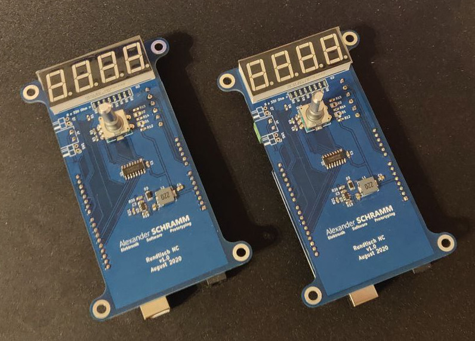

# Rundtisch NC
Rundtisch NC is a numerical control for indexing heads. It allows you to set a number of divisons using a rotary encoder and then drives the right distance on the push of a button.

*For international visitors: Unfortunately this repository is mostly in german. A notable exception to this is the firmware. In the future there might be a english version, but for now there isn't one 😪*

[User manual 🇺🇸🇬🇧 / Bedienungsanleitung 🇩🇪 (.pdf)](./doc/bedienungsanleitung.pdf)

## License
- Firmware: MIT
- Documentation, PCB layout, schematic, images: Creative Commons CC-BY (or MIT)